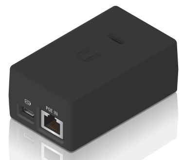

# The Ubiquiti airGateway Pro-Installer as a PoE Powered WiFi Access Point (AP)

The [airGateway Pro-Installer](https://ubwh.com.au/Ubiquiti/Accessories/AG-PRO-INS) can be easily configured as standard WiFi AP, making it suitable for applications that need:
* A small, cheap AP
* PoE powered (24V PoE)

## Instructions
1. Download the [config file](https://github.com/UBWH/ubwh_support.github.io/raw/main/assets/AGinsAP.zip) to your laptop/tablet
   * Unzip the downloaded file to extract the file `AGinsAP.cfg`
1. Start with the unit in Factory Default mode
1. Connect an ethernet cable between:
   * A 24V PoE supply (Pins 4,5 (+DC)  7,8 (-DC)
   * The POE OUT socket on the unit. (That is not a typo: Yes - connect to POE OUT)
1. Using a laptop/tablet: Connect using WiFi to the SSID that looks like `airGateway:xxxxxxxxxxxx`  (xxx=MAC address)
1. Using a web browser, visit `http://192.168.1.1`
   * Login:    ubnt
   * Password: ubnt
   * Country: select as needed
   * `I agree to these terms of use` : checked
   * Login
1. Go to the SYSTEM Tab
   * In the `Configuration Management` section: Upload the `AGinsAP.cfg` file downloaded above
   * Click: Apply
   * Wait until unit reboots. It will reboot with an IP address acquired from the local DHCP server.
1. Using a laptop/tablet: Connect using WiFi to the SSID that looks like `www.ubnt.com`
1. Connect to the new IP address of the unit. Try these in the order shown:
   * http://ubnt.lan
   * http://ubnt.local
   * http://ubnt
   * Query your DHCP server to find the IP address it has assigned to the airGateway, then visit: `http://<ip address>`
1. Login 
   * Login:    ubnt
   * Password: ubnt
1. Go to the WIRELESS tab
   * SSID: Change to the WiFi SSID you want
   * Security: Enabled
   * Password: Change to the WiFi password you want
   * Click: Apply
   * Wait until unit reboots
1. Login again and go to the SYSTEM tab
   * System Accounts: Click the picture of the key
   * Current password: `ubnt`
   * New password: enter new password
   * Verify New password: enter new password
   * Click: Change
   * Click: Apply
  
The unit should now behave as a simple AP. 

  
